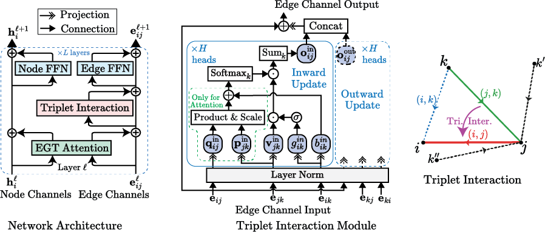

# Triplet Graph Transformers (Edge-augmented Graph Transformer with Triplet Interaction)

<a href="https://arxiv.org/abs/2402.04538"></a>
[](https://paperswithcode.com/sota/graph-regression-on-pcqm4mv2-lsc?p=triplet-interaction-improves-graph)
[](https://paperswithcode.com/sota/initial-structure-to-relaxed-energy-is2re?p=triplet-interaction-improves-graph)



## News

- **03/18/2024** We have added the data preparation scripts (in the `lib/data/pcqm` directory) which should help elucidate the data preparation process. We also added simplified instructions for inference.

- **02/29/2024** We have released the model weights for the best-performing model (TGT-At) and also a lightweight model (TGT-Agx2) for the PCQM4Mv2 dataset. The weights can be found at <https://huggingface.co/shamim-hussain/tgt> and can be used for inference and transfer learning. We have also updated and added the config files for the training and inference of these models. The code has also been cleaned and updated.
- **02/09/2024** The preprint of our paper ["Triplet Interaction Improves Graph Transformers: Accurate Molecular Graph Learning with Triplet Graph Transformers"](https://arxiv.org/abs/2402.04538) is now available on ArXiv. We will include our new results, methods, along with model weights soon.

## Introduction

This is the official implementation of the Triplet Graph Transformer (TGT) which is an extension upon the Edge-augmented Graph Transformer (EGT). Triplet interaction extends the pairwise channels in EGT to allow for 2 pairs sharing a common node to interact with each other, which is found to be beneficial for molecular property prediction. We employ a two-stage model with the same architecture. The first stage produces an estimation of pair-wise distances between atoms, which is then used by the second stage to predict the HOMO-LUMO gap. The training is carried out in three stages - (i) training of the distance predictor, (ii) pretraining of the gap predictor with noisy coordinates and (iii) fine-tuning of the gap predictor with predicted distances. For more information see our [paper](https://arxiv.org/abs/2402.04538).

## Results

Model                   |Dist. Pred. #layers (#params) | Gap Pred. #layers (#params) | Valid MAE       | Test-dev MAE   |
------------------------|------------------------------|-----------------------------|-----------------|----------------|
TGT-Agx2 + RDKit Coords\* |       12 x 2 (47M)           |       12 x 2 (47M)          | 68.2 meV        |  -             |
TGT-At (No RDKit Coords)|       24 (102M)              |        24 (102M)            | 68.6 meV        | 69.8 meV       |
TGT-At + RDKit Coords   |       24 (102M)              |        24 (102M)            | **67.1 meV**    | **68.3 meV**   |

\*x2 denotes that two consecutive layers share the same set of parameters, which improves parameter efficiency while increasing the depth.

## Requirements

- `python >= 3.7`
- `pytorch >= 1.6.0`
- `numpy >= 1.18.4`
- `numba >= 0.50.1`
- `ogb >= 1.3.2`
- `rdkit>=2019.03.1`
- `yaml >= 5.3.1`
- `pyarrow >= 8.0.0`
- `nvidia-apex (recommended)`

## Downloading the Data

The preprocessed data is available at <https://huggingface.co/datasets/shamim-hussain/pcqm>. The `parquet` and `npz` files must be put in the `data/PCQM` directory. You can also download them by running the following command:

```
bash download_data.sh
```

#### (Alternative) Prepare the Data from Scratch

To prepare the data from scratch, you can run the following commands:

```
# Prepare data except for the RDKit coordinates
python -m lib.data.pcqm.prepare_data

# Prepare RDKit coordinates
python -m lib.data.pcqm.prepare_rdkit_coords
```

The above scripts will create the `parquet` and `npz` files in the `data/PCQM` directory. The `prepare_rdkit_coords` script will create the `rdkit_coords.parquet` file in the same directory. Since preparation of the RDKit coordinates can be time-consuming, we have provided a separate script for this. Also, you may refer to these scripts (in the `lib/data/pcqm` directory) for the details of the data preparation process.

## Downloading the Model Weights

The model weights are available at <https://huggingface.co/shamim-hussain/tgt>. You may directly copy the models directory from the huggingface repository. The raw weights are contained in the model_state.pt files in the checkpoint directories.

## Run Evaluation (Inference) Only on Validation Set

An example Jupyter Notebook for inference is [here](inference_example.ipynb). You can also follow these instructions to perform inference on the validation set:

1. Download the data and model weights as described above.
2. Make distance predictions on the validation set
    ```
    python make_predictions.py configs/pcqm/tgt_at_200m/dist_pred/tgt_at_dp_rdkit.yaml 'predict_on: ["val"]'
    ```
    This will create a `predictions` directory (e.g. `bins50`) in the model directory, containing the predictions for the training and validation sets. To reduce the number of distance samples (and thus save time and disk space) add the following argument `'prediction_samples: 10'` (we used 50 samples, you can increase it during the final inference to get better results).
3. Final evaluation (on the validation set):
    ```
    python do_evaluations.py configs/pcqm/tgt_at_200m/gap_pred/tgt_at_tp_rdkit.yaml 'predict_on: ["val"]'
    ```
    the results will be printed to the console and also saved in the predictions directory

## Run Training and Evaluations

You can specify the training/prediction/evaluation configurations by creating a `yaml` config file and also by passing a series of `yaml` readable arguments. (Any additional config passed as an argument will override the config specified in the file.)

- To run training: ```python run_training.py [config_file.yaml] ['config1: value1'] ['config2: value2'] ...```
- To make predictions: ```python make_predictions.py [config_file.yaml] ['config1: value1'] ['config2: value2'] ...```
- To perform evaluations: ```python do_evaluations.py [config_file.yaml] ['config1: value1'] ['config2: value2'] ...```

Config files for the results can be found in the configs directory. Examples:

```
python run_training.py configs/pcqm/tgt_at_200m/finetune/tgt_at_dp_rdkit.yaml
python run_training.py 'scheme: pcqm.dist_pred' 'model_height: 6'
python make_predictions.py configs/pcqm/tgt_at_200m/dist_pred/tgt_at_dp_rdkit.yaml 'predict_on: ["train", "val"]'
```

### Triplet Interaction Type

Our default configs are for triplet *attention*. To use triplet *aggregation* instead, in the config files, set `triplet_type: aggregation`. You can also use prvious methods - `triangular_update` and `axial_attention` or our ungated variants - `attention_ungated` and `aggregation_ungated`.

### More About Training

Once the training is started a model directory will be created in the `models` directory, under the specified training stage/scheme name. This directory will contain a copy of the input config file, for the convenience of resuming training/evaluation. Also, it will contain a config.yaml which will contain all configs, including unspecified default values, used for the training. Training will be checkpointed per epoch. In the case of any interruption, you can resume training by running the `run_training.py` with the config.yaml file again (you may also simply specify the directory containing `config.yaml` as a shorthand).

As mentioned before, the training is carried out in stages. Here is an example of the sets of commands for training and inference (with RDKIT coords) -

```
# Stage 1 - Train the distance predictor
python run_training.py configs/pcqm/tgt_at_200m/dist_pred/tgt_at_dp_rdkit.yaml

# Make distance predictions (on the training and validation sets by default)
python make_predictions.py configs/pcqm/tgt_at_200m/dist_pred/tgt_at_dp_rdkit.yaml

# this will create a 'predictions' directory (e.g. bins50) in the model directory, containing the predictions for the training and validation sets
# to reduce the number of distance samples (and thus save time and disk space)
# add the following argument 'prediction_samples: 10'
# (we used 50 samples, you can increase it during final inference to get better results),
# to predict on the test set add the following argument 'predict_on: ["test"]'


# Stage 2 - Pretrain the gap predictor with noisy coordinates
python run_training.py configs/pcqm/tgt_at_200m/pretrain/tgt_at_tp.yaml

# this will create a 'checkpoint' directory in the model directory
# the model_state.pt file in the last checkpoint will be used for the next stage


# Stage 3 - Fine-tune the gap predictor with predicted distances
python run_training.py configs/pcqm/tgt_at_200m/finetune/tgt_at_tp_rdkit.yaml

# make sure that the 'bins_input_path' points to the correct distance predictions,
# e.g., 'models/pcqm/tgt_at_200m/dist_pred/tgt_at_dp_rdkit/predictions/bins50'
# and the 'pretrained_weights_file' points to the correct pretrained checkpoint,
# e.g., 'models/pcqm/tgt_at_200m/pretrain/tgt_at_tp/checkpoint/model_state.pt'


# Stage 4 - Do final evaluation (and trim the model by removing the denoising head)
python run configs/pcqm/tgt_at_200m/gap_pred/tgt_at_tp_rdkit.yaml

# make sure the 'pretrained_weights_file' points to the correct checkpoint from the finetuning stage,
# e.g., 'models/pcqm/tgt_at_200m/finetune/tgt_at_tp_rdkit/checkpoint/model_state.pt'
# this does not really do any training, but it will create a 'checkpoint' directory
# in the model directory, containing the final checkpoint, without the denoising head

# Final evaluation:
python do_evaluations.py configs/pcqm/tgt_at_200m/gap_pred/tgt_at_tp_rdkit.yaml

# the results will be printed to the console and also saved in the predictions directory
# in case of the test-dev split it will also create as submission file in the model directory
```

### TorchRun and Multi-Nodes Training

The basic Python scripts are capable of running on multiple GPUs on a single node (by internally spawning multiple processes). However, they support `torchrun` as well (detected via checking the environment set by `torchrun`). The `torchrun` method is more efficient in training on multiple nodes. An example training script for `slurm` is provided as `torchrun.sh`.

## Python Environment

The Anaconda environment in which the experiments were conducted is specified in the `environment.yml` file.

## Citation

Please cite the following paper if you find the code useful:

```
@article{hussain2024triplet,
  title={Triplet Interaction Improves Graph Transformers: Accurate Molecular Graph Learning with Triplet Graph Transformers},
  author={Hussain, Md Shamim and Zaki, Mohammed J and Subramanian, Dharmashankar},
  journal={arXiv preprint arXiv:2402.04538},
  year={2024}
}
```
